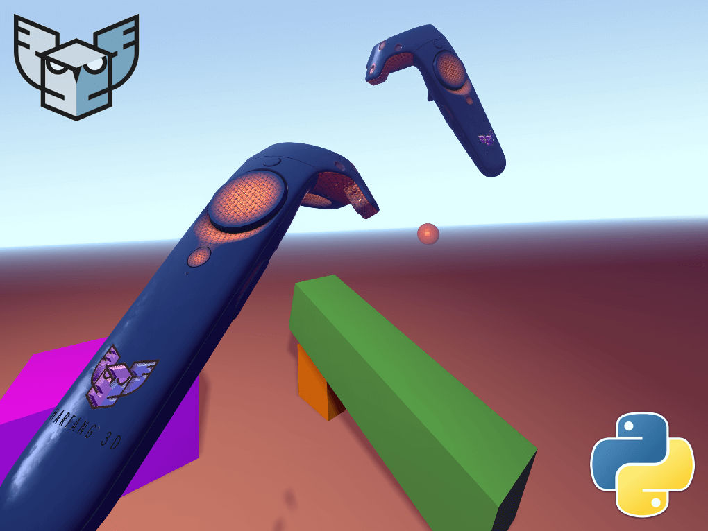
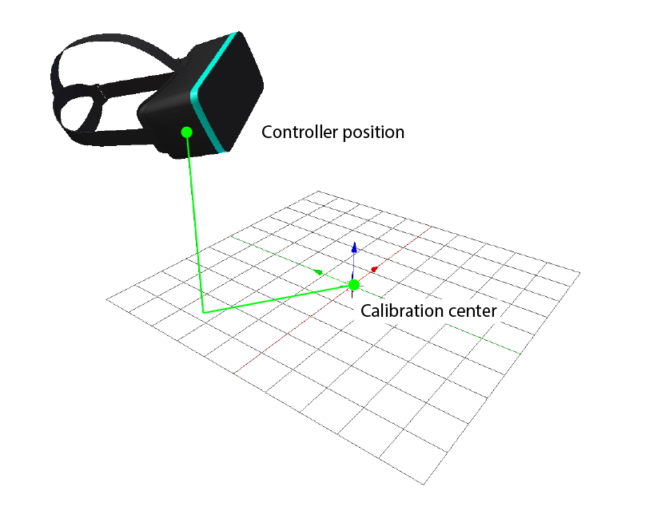
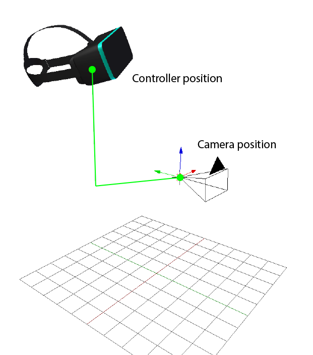

#  HARFANG® 3D 

##  VR Headset Controller Tutorial


## Requirements

[HARFANG® 3D](https://www.harfang3d.com/) > 1.2.0  

On Windows, retrieve HARFANG® 3D using PIP
```shell
pip install -r requirements.txt
```
On others systems, retrieve the last wheel on [HARFANG® 3D](https://www.harfang3d.com/download) website.
```shell
pip install harfang.whl
```

## Setup

To enable the VR in HARFANG we need to switch to a specific FrameRenderer.  
First, we ask if the frame renderer plugin called "VR" is available.
```python
openvr_frame_renderer = hg.CreateFrameRenderer("VR")
```
Then we initialize the renderer to setup OpenVR system. It can return true or false.
```python
if openvr_frame_renderer.Initialize(plus.GetRenderSystem()):
```
Once initialized, we add the system in the scene which will take care of the update of the head/controllers matrices and the rendering with the correct transformation.
```python
scn.GetRenderableSystem().SetFrameRenderer(openvr_frame_renderer)
```
## Update controllers matrices

HARFANG® gives the controllers' matrices in the real world. The matrices relate to the VR calibration position.  
To set the controllers' matrices in the virtual world, we need to multiply them by the position that represent the calibration center in the scene. From our point of view, this is the camera matrix.  

#### In real world



#### In virtual world



### Example:  
To get the controller
> * `"VR Controller 0"` : Right handheld controller
> * `"VR Controller 1"` : Left handheld controller
> * `"HMD"` : headset controller
```python
controller = hg.GetInputSystem().GetDevice("VR Controller 0")
```
To get the controller's matrix
```python
controller_mat = controller.GetMatrix(hg.InputDeviceMatrixHead)
```
To set the controller's matrix to the geometry in the virtual world
```python
virtual_controller_mat = cam_matrix * controller_mat
controller_node.GetTransform().SetWorld(virtual_controller_mat)
```

### About headset matrix
If you need to get the matrix of the head, multiply the camera matrix by the headset matrix.
```python
controller = hg.GetInputSystem().GetDevice("HMD")
controller_mat = controller.GetMatrix(hg.InputDeviceMatrixHead)
cam_matrix = scene.GetCurrentCamera().GetTransform().GetWorld()
head_mat = cam_matrix * controller_mat
```

## Conclusion

That's it, you are now VR-enabled right within Python!  
This tutorial using the HARFANG® engine was tested so far on the HTC Vive, the Oculus Rift and the Lenovo Mixer Reality headsets.  
The same should apply to every OpenVR-compatible headset.
  
(Tutorial created by Eric Kernin, VR Teleporter by Thomas Simonnet).